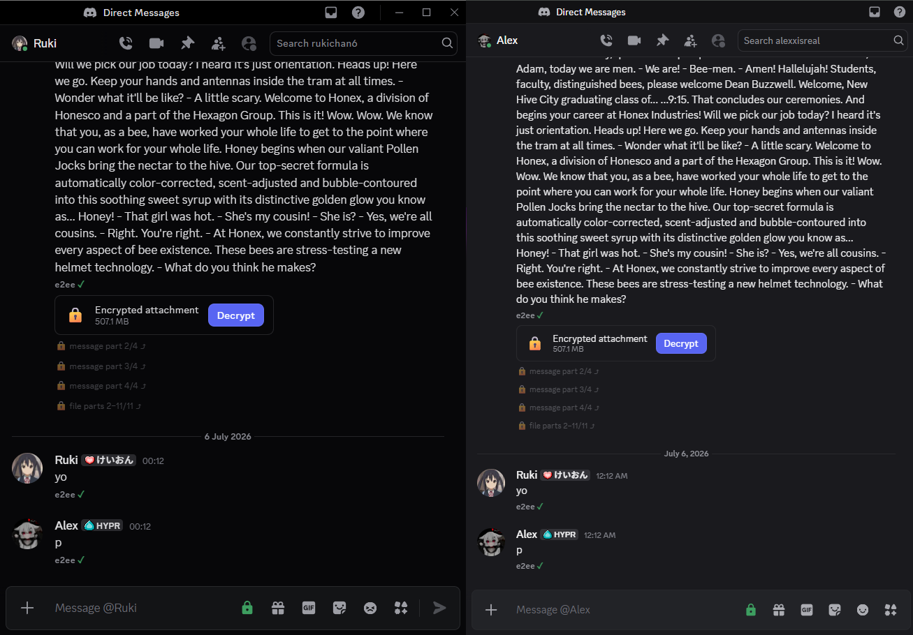
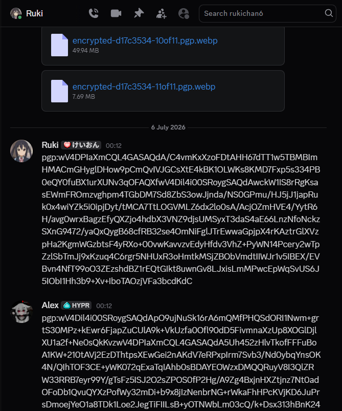

# PgpEncrypt

With plugin:



Without plugin (not decrypted):



A Vencord userplugin for sending and receiving PGP encrypted Discord DMs.

## Features

- Seamless end-to-end encryption in DMs using PGP
- Per-DM toggle
- PGP signatures
- Encrypted attachments
- Long message splitting
- Large file splitting - large files are split into multiple files to circumvent file size limits. it's reassembled automatically on clients.
- Key management
- Key sharing and trust - share your public key by right clicking the lock icon

## Quick install/update (Windows)

`install.ps1` automatically installs and injects Vencord with this plugin. It is safe to re-run any time to update. From any PowerShell window:

```powershell
irm https://raw.githubusercontent.com/Alex7k/DiscordPgpEncryption/main/install.ps1 | iex
```

After running this, start discord and enable the `PgpEncrypt` plugin in Vencord settings.

## Prerequisites

You need Git, Node.js 22 or newer, and pnpm. Pick the command block for your OS:

Windows PowerShell:

```powershell
winget install --id Git.Git -e
winget install --id OpenJS.NodeJS.LTS -e
corepack enable
corepack prepare pnpm@11.9.0 --activate
```

macOS with Homebrew:

```sh
brew install git node
corepack enable
corepack prepare pnpm@11.9.0 --activate
```

Debian/Ubuntu:

```sh
sudo apt update
sudo apt install -y git curl
curl -fsSL https://deb.nodesource.com/setup_22.x | sudo -E bash -
sudo apt install -y nodejs
corepack enable
corepack prepare pnpm@11.9.0 --activate
```

Check that everything is available:

```sh
git --version
node --version
pnpm --version
```

## Install

Run these from the folder where you want Vencord installed:

```sh
git clone https://github.com/Vendicated/Vencord
cd Vencord
git clone https://github.com/Alex7k/DiscordPgpEncryption src/userplugins/pgpEncrypt
pnpm install --frozen-lockfile
pnpm add -w openpgp
pnpm add -Dw @openpgp/web-stream-tools
pnpm build
pnpm inject
```

If you already have Vencord, start at `cd Vencord`.

## Update

Run these from your Vencord folder:

```sh
git pull --rebase --autostash
git -C src/userplugins/pgpEncrypt pull
pnpm install
pnpm build
pnpm inject
```

The `pnpm add` lines in the install step are needed because stock Vencord does not ship the OpenPGP dependencies this plugin uses.
